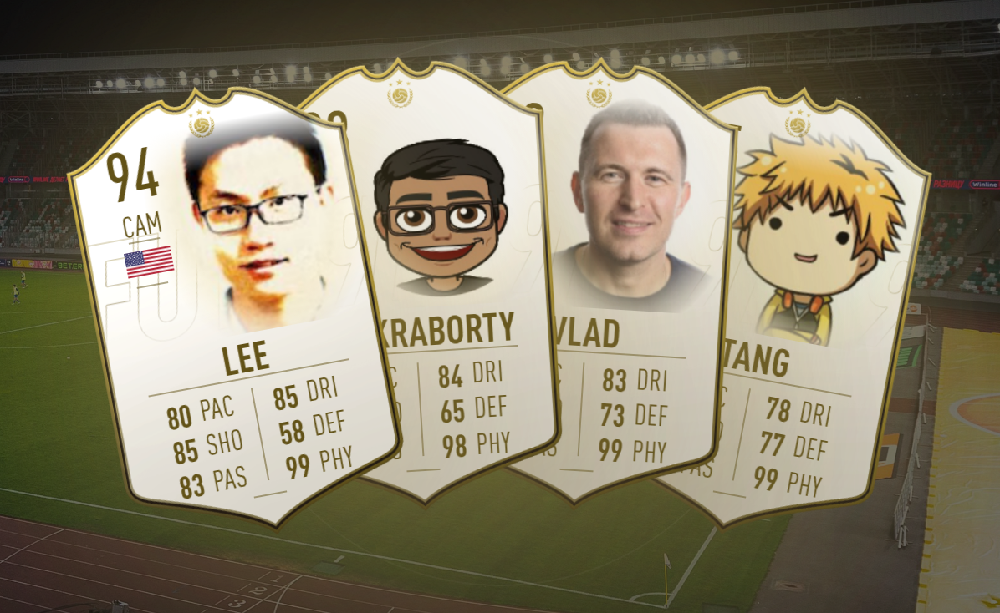

<div align="center">


# LeetFut

**your LeetCode, rated out of 99** ⚽


<br/><br/>



<br/>


</div>

<br/>

## ⚽ &nbsp;What it does

Drop in any LeetCode username and LeetFut scouts the public profile, reads six real signals, and prints a **FIFA-Ultimate-Team-style player card** rated out of 99 — position, archetype, finish and all. No surveys, no self-reporting. Just the solves.

| | |
|:--|:--|
| 🃏 **Player card** | Any LeetCode profile → a rated-out-of-99 card with six stats, a position and an archetype |
| 📈 **Live scoring** | Six signals read straight from the LeetCode API — solves, hard tier, contests, streaks, accuracy, breadth & badges |
| 🥇 **Finishes** | Bronze → Silver → Gold → In-Form → TOTY → Icon, earned from your overall + longevity |
| ⚔️ **The Duel** | Head-to-head, 1-v-1: your card vs a rival's, six stats, one winner |
| 🏆 **The League** | Rank your whole crew — you + up to four teammates — into a 1st / 2nd / 3rd table |
| 🖼️ **Embeddable** | Your card lives at a URL as a live image — drop it in a README or portfolio and it re-scouts itself |

<br/>

## ⚙️ &nbsp;How the scouting works

Six signals from public LeetCode data, each mapped to a football stat.

| | Stat | Scouted from |
|:--:|:--|:--|
| **CNS** | Consistency | Streak + active days |
| **HRD** | Hard mastery | Hard problems solved |
| **CTS** | Contest | Contest rating |
| **VER** | Versatility | Topics + languages |
| **ACC** | Accuracy | Acceptance rate |
| **VOL** | Volume | Total solved + years active |

Your **overall** is a position-weighted blend, not a flat mean. Raw stats cap at **88** — the top slice is a legacy gate earned with years, contest standing, a deep back-catalogue and earned **badges**, so one heroic year won't crown you an Icon. Your **position** and **archetype** are read from your stat shape.

Every card walks out in a finish:

<div align="center">


</div>

<br/>

## 🚀 &nbsp;Run it locally

No Docker required — with no API base set, LeetFut serves the built-in showcase cards instantly and fetches any other profile from the public LeetCode API.

```bash
git clone https://github.com/sanskarjoshiii/leetfut.git
cd leetfut
npm install

# development (hot reload)
npm run dev            # http://localhost:3001

# production
npm run build
npm start              # http://localhost:3000
```

**Optional** — a self-hosted [alfa-leetcode-api](https://github.com/alfaarghya/alfa-leetcode-api) instance for higher rate limits, and Redis for a read-through card cache:

```bash
# .env.local
LEETCODE_API_BASE=http://localhost:3000
# REDIS_URL=redis://localhost:6379
```

<br/>

## 🧱 &nbsp;Built with

**Next.js 16** · **TypeScript** · **Tailwind CSS 4** · **Redis** (optional) · card art rendered with `@vercel/og` + `sharp`

<br/>

<div align="center">

**built by [@sanskarjoshiii](https://github.com/sanskarjoshiii)** &nbsp;·&nbsp; **inspired by [@gitfut](https://gitfut.com)**


</div>
